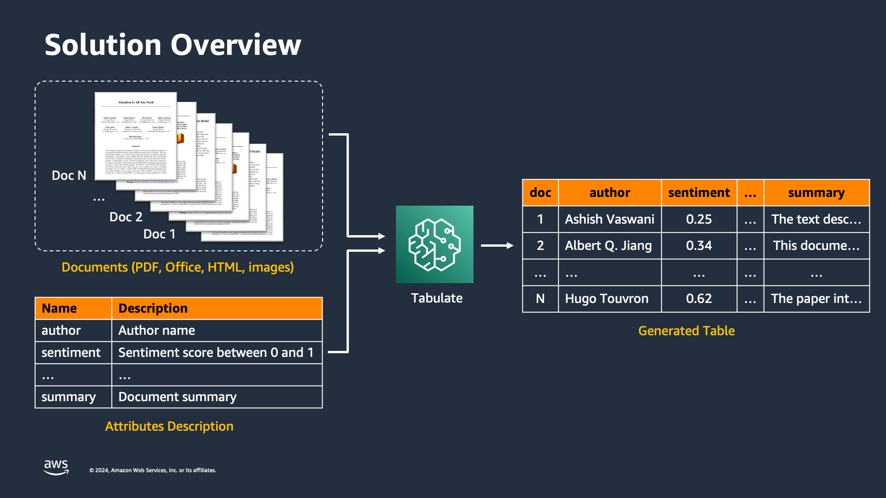
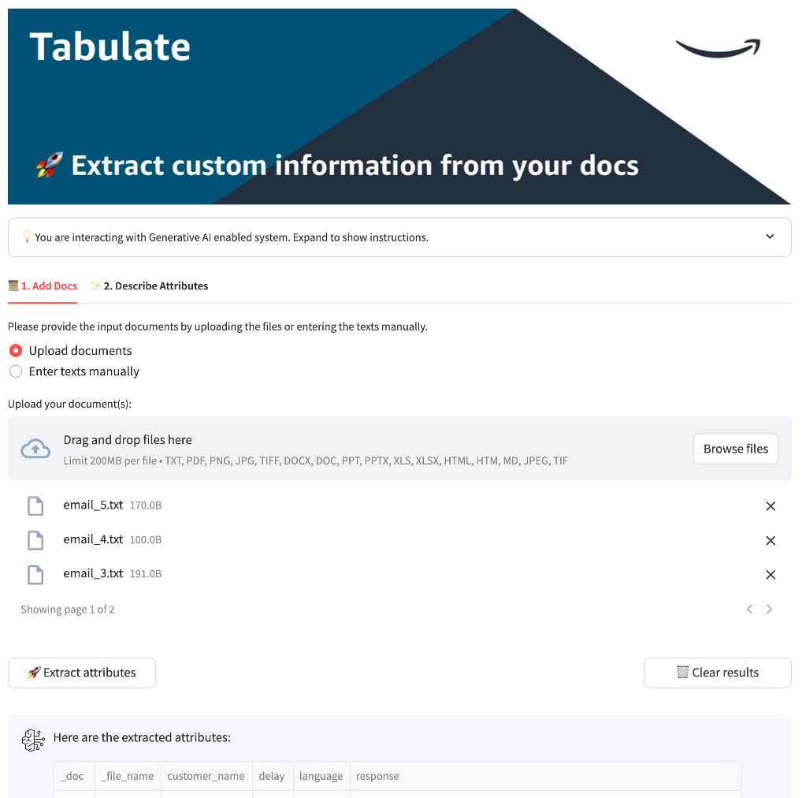
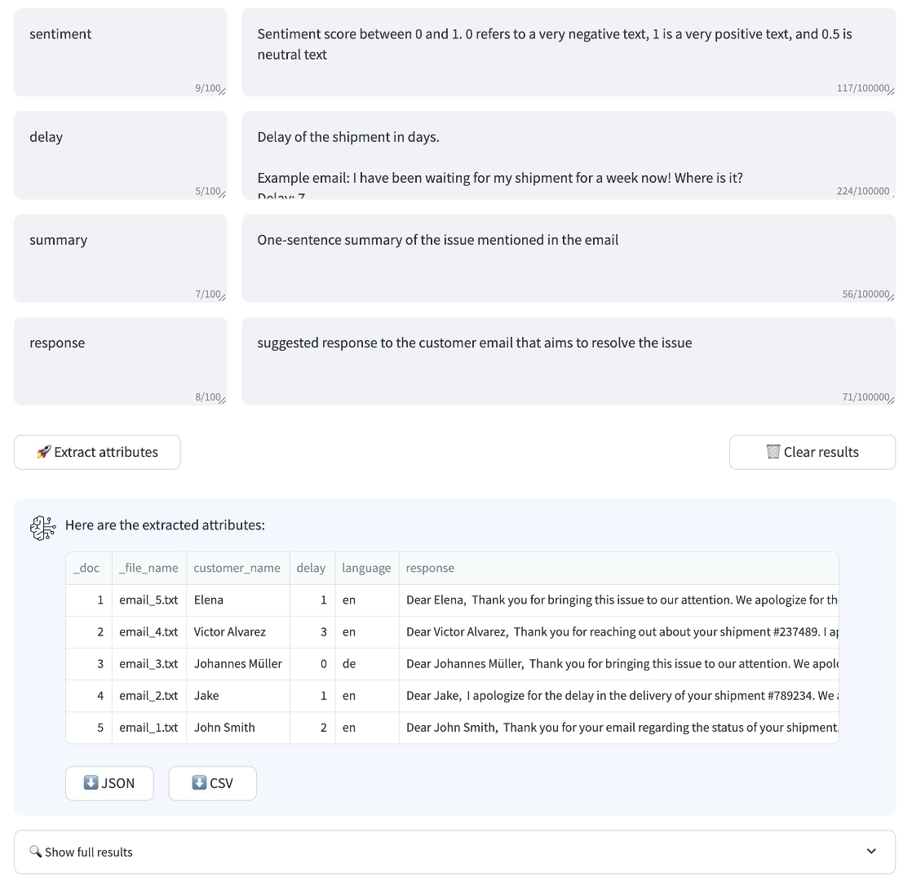

# Tabulate

🚀 Extract custom information from unstructured documents with Generative AI

## Contents

- [Overview](#overview)
- [Deploy the App](#deploy-the-app)
- [Use the App](#use-the-app)
- [Team](#team)


# 🔥 Overview

Tabulate is a CDK stack solution with the following features:
- extract well-defined entities (e.g., name), numeric scores (e.g., sentiment) and free-form content (e.g., summary)
- describe the list of attributes to be extracted from your docs without costly data annotation or model training
- use [Python API](demo/tabulate_demo.ipynb) or the [web app UI](assets/streamlit/src/Home.py) to analyze PDF, Office or image docs



[Click here](https://amazon.awsapps.com/workdocs-preview/index.html#/document/5293b86037bf121c40721ff58ea5ee9bee0f0498e5564b4a7ee6456b89fb17ed) to see a 1-minute demo recording.

Refer to [the demo notebook](demo/tabulate_demo.ipynb) for the implementation and usage examples.

**Note**: do not use the name "Tabulate" when presenting the solution in external customer engagements.


**Example API call**

```python
docs = ['doc1', 'doc2']

features = [
    {"name": "delay", "description": "delay of the shipment in days"},
    {"name": "shipment_id", "description": "unique shipment identifier"},
    {"name": "summary", "description": "one-sentence summary of the text"},
]

run_tabulate_api(
    documents=docs,
    features=features,
)
# [{'delay': 2, 'shipment_id': '123890', 'summary': 'summary1'},
# {'delay': 3, 'shipment_id': '678623', 'summary': 'summary2'}]
```

**Example Web UI**

<p float="left">
  
   
</p>


# 🔧 Deploy the App

### Prerequisites

Make sure you have installed the following tools, languages as well as access to the target AWS account:

- [AWS CLI](https://cdkworkshop.com/15-prerequisites/100-awscli.html)
- [AWS Account and User](https://cdkworkshop.com/15-prerequisites/200-account.html): we suggest configuring an AWS account with a profile `$ aws configure --profile [profile-name]`
- [Node.js](https://cdkworkshop.com/15-prerequisites/300-nodejs.html)
- [IDE for your programming language](https://cdkworkshop.com/15-prerequisites/400-ide.html)
- [AWS CDK Toolkit](https://cdkworkshop.com/15-prerequisites/500-toolkit.html)
- [Python](https://cdkworkshop.com/15-prerequisites/600-python.html)


### Clone the Repo

Clone the repo to a location of your choice:

```bash
git clone git@ssh.gitlab.aws.dev:genaiic-reusable-assets/demo-artifacts/tabulate.git
```

### Activate Environment

Navigate to the project folder and execute the following commands to create a virtualenv on MacOS and Linux and install dependencies:

```bash
python3 -m venv .venv
source .venv/bin/activate
pip install poetry
poetry install
```

### Configure the Stack

Open and modify the `config.yml` file to specify your project name and modules you would like to deploy (e.g., whether to deploy a web app)

```yaml
stack_name: tabulate   # Name of your demo, will be used as stack name and prefix for resources

...

streamlit:
  deploy_streamlit: True
```

### CDK Bootstrap & Deploy

Bootstrap CDK in your account, ideally using the profile name you have used in the `aws configure` step. You can easily configure multiple accounts and bootstrap and deploy the framework to different accounts.

```bash
cdk bootstrap --profile [PROFILE_NAME]
```

Make sure the docker daemon is running in case you deploy the streamlit frontend. (On mac you can just open docker desktop)

You can deploy the framework stack.

```bash
cdk deploy --profile [PROFILE_NAME]
```


# 💻 Use the App

## Option 1: Run API with Python

Follow steps in this [notebook](demo/tabulate_demo.ipynb) to run a job via an API call. You will need to:
- provide input document text(s)
- provide a list of features to be extracted

## Option 2: Run web app

### Add Cognito Users

- Open the Cognito Console, choose the created user pool, and click create user
- Provide the user name and a temporary password or email address for auto-generated password
    - Users will be able to log into the frontend using Cognito credentials

### Access the Frontend

- The URL to access the frontend appears as output at the end of the CDK deployment under "CloudfrontDistributionName"

or

- Open the AWS console, and go to CloudFront
- Copy the Domain name of the created distribution


# 👥 Team

Core team:

|  | 
|---|---|
| [Nikita Kozodoi](https://phonetool.amazon.com/users/kozodoi) | [Nuno Castro](https://phonetool.amazon.com/users/nunoca) |
| Owner & Maintainer | Science Manager |

Contributors:

 |  |  |  |
|---|---|---|---|
[Romain Besombes](https://phonetool.amazon.com/users/rbesomb) | [Zainab Afolabi](https://phonetool.amazon.com/users/zafolabi) | [Ivan Sosnovik](https://phonetool.amazon.com/users/issosno) | [Huong Vu](https://phonetool.amazon.com/users/huongvu) | 

Acknowledgements:

- [Aiham Taleb](https://phonetool.amazon.com/users/aitaleb)
- [Liza Zinovyeva](https://phonetool.amazon.com/users/zinovyee)
- [Tan Takher](https://phonetool.amazon.com/users/ttakher)